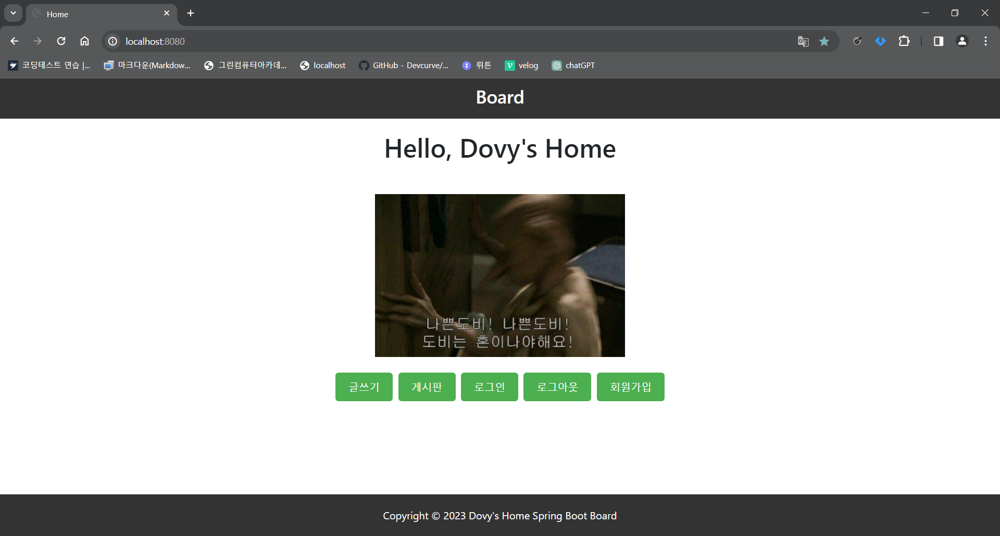
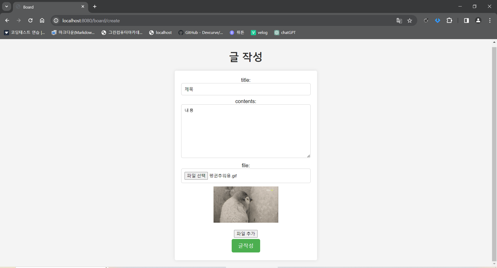

# Board v1.7.2

## 개발환경
IDE: IntelliJ IDEA Community  
Spring Boot 2.7.6  
JDK 11  
mysql 8.0.35  
Lombok  
Spring Data JPA
Spring Web   
Thymeleaf  
aplication.yml

## 게시판 주요 기능

### 게시글
1. 게시글 작성(/board/save, /create)  
\- 게시글 저장  
\- 파일(이미지) 첨부

2. 게시글 목록(/board/,/board/paging)  
\- 한 페이지 게시글 5개  
\- 최대 3개 페이지씩  
\- /board/paging?page=1  
\- /board/paging/1

3. 게시글 조회(/board/{id})

4. 게시글 수정(/board/update/{id})
\- 상세화면에서 수정 버튼 클릭    
\- 서버에서 해당 게시글의 정보를 가지고 수정 화면 출력    
\- 제목, 내용 수정 입력 받아서 서버로 요청  

5. 게시글 삭제(/board/delete/{id})  
\- 상세화면에서 삭제 버튼 클릭  
\- 삭제시 home화면 으로 이동
---

### 댓글
1. 댓글 작성(/comment/save)  
\- 작성자와 내용 입력 후 댓글 작성

2. 댓글 목록(/list/{boardId})  
\- 해당 게시글 id에 달린 댓글 리스트 보이기

3. 댓글 수정(/update/{commentId})  
\- 댓글 수정 버튼 클릭 후 수정 내용 작성  
\- 확인(댓글 수정 버튼이 확인버튼으로 바뀜) 버튼 클릭

4. 댓글 삭제(/delete/{commentId)

---
### 파일
1. 파일 다운(/download/{uuid}/{fileName})
2. 파일 수정(board/update/{id})  
\- 게시글 수정 화면에 파일 변경 가능
3. 파일 삭제(file/delete/{boardId})  
\- 성공시 파일 삭제하였습니다 팝업 창

## 향후 업데이트 예정 기능
1. 다중 파일 첨부 기능

#### v1.0.0 (2023.11.21)
1. [추가] 게시판 생성(/board/save)

#### v1.1.0 (2023.11.22)
1. [추가] 게시글 페이징(/board/paging, /board/)  
\- 한 페이지 5개씩  
\- 페이지 최대 3개씩

#### v1.2.0 (2023.11.23)
1. [추가] 게시글 수정
2. [추가] 게시글 삭제

#### v1.3.0 (2023.11.24)
1. [추가] 댓글 생성(/comment/save)

#### v1.4.0 (2023.11.27)
1. [추가] 게시글 파일 업로드

#### v1.5.0 (2023.11.28)
1. [추가] 게시글 파일 다운로드(/download/{uuid}/{fileName})

#### v1.6.0 (2023.11.29)
1. [추가] 댓글 수정(/update/{commentId})
2. [추가] 댓글 삭제(/delete/{commentId})

#### v1.7.0 (2023.12.01)
1. [추가] 파일 삭제(file/delete/{boardId})

#### v1.7.1 (2023.12.01)
1. [수정] home html 헤더 내용 변경, 섹션 삭제

#### v1.7.2 (2023.12.11)
1. [수정] 게시글 목록 이전 다음 버튼
2. [수정] detail 작성자 <-> 내용 바뀌어서 출력
3. [추가] title, contents 필드 nullable = false
4. [추가] 파일 다운로드 버튼, 파일 프리뷰

### * ing- 로그인 User -> 게시판 연동
#### v2.7.2 (2023.12.12)
1. [추가] User, 로그인, 회원가입, HomeController
2. [수정] 패키지, 구조 변경
